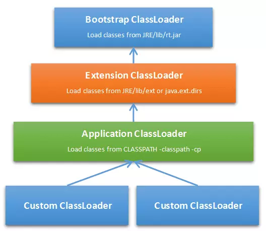

## 什么是类的加载


Java虚拟机把描述类的数据从Class文件加载到内存，并对数据进行校验、转换解析和初始化，最终形成可以被虚拟机直接使用的Java类型，这就是虚拟机的加载机制。*
Class文件由类装载器装载后，在JVM中将形成一份描述Class结构的元信息对象，通过该元信息对象可以获知Class的结构信息：如构造函数，属性和方法等，Java允许用户借由这个Class相关的元信息对象间接调用Class对象的功能,这里就是我们经常能见到的Class类。


## 类的加载

### 类初始化时机

　　那么，什么情况下虚拟机需要开始初始化一个类呢？这在虚拟机规范中是有严格规定的，虚拟机规范指明，有且只有 五种情况必须立即**对类进行初始化**（而这一过程自然发生在加载、验证、准备之后）：

　　1) **遇到new、getstatic、putstatic或invokestatic这四条字节码指令**（注意，newarray指令触发的只是数组类型本身的初始化，而不会导致其相关类型的初始化，比如，new String[]只会直接触发String[]类的初始化，也就是触发对类[Ljava.lang.String]的初始化，而直接不会触发String类的初始化）时，如果类没有进行过初始化，则需要先对其进行初始化。生成这四条指令的最常见的Java代码场景是：

* 使用new关键字实例化对象

* 读取或设置一个类的静态字段（被final修饰，已在编译器把结果放入常量池的静态字段除外）

* 调用一个类的静态方法

　　2) 使用java.lang.reflect包的方法对类进行反射调用的时候，如果类没有进行过初始化，则需要先触发其初始化。

　　3) 当初始化一个类的时候，如果发现其父类还没有进行过初始化，则需要先触发其父类的初始化。

　　4) 当虚拟机启动时，用户需要指定一个要执行的主类（包含main()方法的那个类），虚拟机会先初始化这个主类。

　　5) 当使用jdk1.7动态语言支持时，如果一个java.lang.invoke.MethodHandle实例最后的解析结果REF_getstatic,REF_putstatic,REF_invokeStatic的方法句柄，并且这个方法句柄所对应的类没有进行初始化，则需要先出触发其初始化。

　　注意，对于这五种会触发类进行初始化的场景，虚拟机规范中使用了一个很强烈的限定语：“有且只有”，这五种场景中的行为称为对一个类进行 主动引用。除此之外，所有引用类的方式，都不会触发初始化，称为被动引用。

　　特别需要指出的是，类的实例化与类的初始化是两个完全不同的概念：

**类的实例化是指创建一个类的实例(对象)的过程；**
**类的初始化是指为类中各个类成员(被static修饰的成员变量)赋初始值的过程，是类生命周期中的一个阶段。**

### 实践部分

* 通过子类引用父类的静态字段，不会导致子类初始化

```java
public class SSClass{
    static{
        System.out.println("SSClass");
    }
}

public class SClass extends SSClass{
    static{
        System.out.println("SClass init!");
    }

    public static int value = 123;

    public SClass(){
        System.out.println("init SClass");
    }
}

public class SubClass extends SClass{
    static{
        System.out.println("SubClass init");
    }

    static int a;

    public SubClass(){
        System.out.println("init SubClass");
    }
}

public class NotInitialization{
    public static void main(String[] args){
        System.out.println(SubClass.value);
    }
}/* Output:
        SSClass
        SClass init!
        123
 *///:~
```
观察到SubClass始终不会被初始化

* 通过数组定义来引用类，不会触发此类的初始化

```java
public class NotInitialization{
    public static void main(String[] args){
        SClass[] sca = new SClass[10];
    }
}
```
SClass并没有初始化，上述案例运行之后并没有任何输出，说明虚拟机并没有初始化类SClass。但是，这段代码触发了另外一个名为[Lcn.edu.tju.rico.SClass]的类的初始化。从类名称我们可以看出，这个类代表了元素类型为SClass的一维数组，它是由虚拟机自动生成的，直接继承于Object的子类，创建动作由字节码指令newarray触发。

* 常量在编译阶段会存入调用类的常量池中，本质上并没有直接引用到定义常量的类，因此不会触发定义常量的类的初始化


```java
public class ConstClass{

    static{
        System.out.println("ConstClass init!");
    }

    public static  final String CONSTANT = "hello world";
}

public class NotInitialization{
    public static void main(String[] args){
        System.out.println(ConstClass.CONSTANT);
    }
}/* Output:
        hello world
 *///:~
```
上述代码运行之后，只输出 “hello world”，这是因为虽然在Java源码中引用了ConstClass类中的常量CONSTANT，但是编译阶段将此常量的值“hello world”存储到了NotInitialization常量池中，对常量ConstClass.CONSTANT的引用实际都被转化为NotInitialization类对自身常量池的引用了。也就是说，实际上NotInitialization的Class文件之中并没有ConstClass类的符号引用入口，这两个类在编译为Class文件之后就不存在关系了。

### 类加载过程


 

**1、加载（Loading）**

　　在加载阶段（可以参考java.lang.ClassLoader的loadClass()方法），虚拟机需要完成以下三件事情：

　　(1). **通过一个类的全限定名来获取定义此类的二进制字节流**（并没有指明要从一个Class文件中获取，可以从其他渠道，譬如：网络、动态生成、数据库等）

 **加载.class文件的方式**
1.从本地系统中直接加载
2.通过网络下载.class文件
3.从zip，jar等归档文件中加载.class文件
4.从专有数据库中提取.class文件
5.将Java源文件动态编译为.class文件

　　(2). **将这个字节流所代表的静态存储结构转化为方法区的运行时数据结构**

　　(3). **在内存中(对于HotSpot虚拟就而言就是方法区)生成一个代表这个类的java.lang.Class对象，作为方法区这个类的各种数据的访问入口**

　　加载阶段和连接阶段（Linking）的部分内容（如一部分字节码文件格式验证动作）是交叉进行的，加载阶段尚未完成，连接阶段可能已经开始，但这些夹在加载阶段之中进行的动作，仍然属于连接阶段的内容，这两个阶段的开始时间仍然保持着固定的先后顺序。

**2、验证（Verification）**

　　验证是连接阶段的第一步，这一阶段的目的是为了确保Class文件的字节流中包含的信息符合当前虚拟机的要求，并且不会危害虚拟机自身的安全。 验证阶段大致会完成4个阶段的检验动作：

文件格式验证：验证字节流是否符合Class文件格式的规范(例如，是否以魔术0xCAFEBABE开头、主次版本号是否在当前虚拟机的处理范围之内、常量池中的常量是否有不被支持的类型)

元数据验证：对字节码描述的信息进行语义分析，以保证其描述的信息符合Java语言规范的要求(例如：这个类是否有父类，除了java.lang.Object之外)；

字节码验证：通过数据流和控制流分析，确定程序语义是合法的、符合逻辑的;

符号引用验证：确保解析动作能正确执行。

　　**验证阶段是非常重要的，但不是必须的，它对程序运行期没有影响** 如果所引用的类经过反复验证，那么可以考虑采用-Xverifynone参数来关闭大部分的类验证措施，以缩短虚拟机类加载的时间。

 **3、准备(Preparation)**

　　准备阶段是正式为类变量(static 成员变量)分配内存并设置类变量初始值（零值）的阶段，这些变量所使用的内存都将在方法区中进行分配。这时候进行内存分配的仅包括类变量，而不包括实例变量，实例变量将会在对象实例化时随着对象一起分配在堆中。其次，这里所说的初始值“通常情况”下是数据类型的零值，假设一个类变量的定义为：

```java
public static int value = 123;
```

　　那么，变量value在准备阶段过后的值为0而不是123。因为这时候尚未开始执行任何java方法，而把value赋值为123的putstatic指令是程序被编译后，存放于类构造器方法<clinit>()之中，所以把value赋值为123的动作将在初始化阶段才会执行。至于“特殊情况”是指：当类字段的字段属性是ConstantValue时，会在准备阶段初始化为指定的值，所以标注为**final**之后，value的值在准备阶段初始化为123而非0。

```java
	public static final int value = 123;
```
**4、解析(Resolution)**

　　解析阶段是虚拟机将常量池内的符号引用替换为直接引用的过程。解析动作主要针对类或接口、字段、类方法、接口方法、方法类型、方法句柄和调用点限定符7类符号引用进行。

**5、初始化(Initialization)**

　　类初始化阶段是类加载过程的最后一步。在前面的类加载过程中，除了在加载阶段用户应用程序可以通过自定义类加载器参与之外，其余动作完全由虚拟机主导和控制。到了初始化阶段，才真正开始执行类中定义的java程序代码(字节码)。

　　在准备阶段，变量已经赋过一次系统要求的初始值(零值)；而在初始化阶段，则根据程序猿通过程序制定的主观计划去初始化类变量和其他资源，或者更直接地说：初始化阶段是执行类构造器<clinit>()方法的过程。<clinit>()方法是由编译器自动收集类中的所有类变量的赋值动作和静态语句块static{}中的语句合并产生的，编译器收集的顺序是由语句在源文件中出现的顺序所决定的，静态语句块只能访问到定义在静态语句块之前的变量，定义在它之后的变量，在前面的静态语句块**可以赋值，但是不能访问**。如下：

 ```java

public class Test{
    static{
        i=0;
        System.out.println(i);//Error：Cannot reference a field before it is defined（非法向前应用）
    }
    static int i=1;
}
  ```

　　那么注释报错的那行代码，改成下面情形，程序就可以编译通过并可以正常运行了。

 ```java
  public class Test{
    static{
        i=0;
        //System.out.println(i);
    }

    static int i=1;

    public static void main(String args[]){
        System.out.println(i);
    }
}/* Output:
        1
 */
  ```
　　类构造器<clinit>()与实例构造器<init>()不同，它不需要程序员进行显式调用，虚拟机会保证在子类类构造器<clinit>()执行之前，父类的类构造<clinit>()执行完毕。由于父类的构造器<clinit>()先执行，也就意味着父类中定义的静态语句块/静态变量的初始化要优先于子类的静态语句块/静态变量的初始化执行。特别地，类构造器<clinit>()对于类或者接口来说并不是必需的，如果一个类中没有静态语句块，也没有对类变量的赋值操作，那么编译器可以不为这个类生产类构造器<clinit>()。

　　虚拟机会保证一个类的类构造器<clinit>()在多线程环境中被正确的加锁、同步，如果多个线程同时去初始化一个类，那么只会有一个线程去执行这个类的类构造器<clinit>()，其他线程都需要阻塞等待，直到活动线程执行<clinit>()方法完毕。特别需要注意的是，在这种情形下，其他线程虽然会被阻塞，但如果执行<clinit>()方法的那条线程退出后，其他线程在唤醒之后不会再次进入/执行<clinit>()方法，因为 在同一个类加载器下，一个类型只会被初始化一次。如果在一个类的<clinit>()方法中有耗时很长的操作，就可能造成多个线程阻塞，在实际应用中这种阻塞往往是隐藏的，如下所示：
  ```java

public class DealLoopTest {
    static{
        System.out.println("DealLoopTest...");
    }
    static class DeadLoopClass {
        static {
            if (true) {
                System.out.println(Thread.currentThread()
                        + "init DeadLoopClass");
                while (true) {      // 模拟耗时很长的操作
                }
            }
        }
    }

    public static void main(String[] args) {
        Runnable script = new Runnable() {   // 匿名内部类
            public void run() {
                System.out.println(Thread.currentThread() + " start");
                DeadLoopClass dlc = new DeadLoopClass();
                System.out.println(Thread.currentThread() + " run over");
            }
        };

        Thread thread1 = new Thread(script);
        Thread thread2 = new Thread(script);
        thread1.start();
        thread2.start();
    }
}/* Output:
        DealLoopTest...
        Thread[Thread-1,5,main] start
        Thread[Thread-0,5,main] start
        Thread[Thread-1,5,main]init DeadLoopClass
 *///:~
```

  ### 实践部分
  初始化顺序** 父类的类构造器<clinit>() -> 子类的类构造器<clinit>() -> 父类的成员变量和实例代码块 -> 父类的构造函数 -> 子类的成员变量和实例代码块 -> 子类的构造函数**

  ```java
  public class StaticTest {
    public static void main(String[] args) {
        staticFunction();
    }

    static StaticTest st = new StaticTest();

    static {   //静态代码块
        System.out.println("1");
    }

    {       // 实例代码块
        System.out.println("2");
    }

    StaticTest() {    // 实例构造器
        System.out.println("3");
        System.out.println("a=" + a + ",b=" + b);
    }

    public static void staticFunction() {   // 静态方法
        System.out.println("4");
    }

    int a = 110;    // 实例变量
    static int b = 112;     // 静态变量
}/* Output:
        2
        3
        a=110,b=0
        1
        4
 *///:~
  ```
  解释下这个结果，因为main函数调用了staticFunction方法，触发了StaticTest类的初始化，StaticTest初始化先执行static语句，因此被执行的第一句是static StaticTest st = new StaticTest();构造一个新的st对象，为了构造一个新的对象，先去执行构造函数
  ```java
  {       // 实例代码块
        System.out.println("2");
    }

    StaticTest() {    // 实例构造器
        System.out.println("3");
        System.out.println("a=" + a + ",b=" + b);
    }
  ```
  也就是这块代码，以及 int a = 110;    // 实例变量，以及为static int b = 112;     // 静态变量分配内存，初始化为0，
  然后继续static代码的执行，输出1，以及最后调用staticFunction，输出4。

###   双亲加载模型
  

  简单的来说，双亲委派制就是当加载一个Class文件时会先交由上层ClassLoader来加载，如果发现已加载则直接返回，如果没有加载则去当前ClassLoader 的classes目录寻找该Class文件，找到则加载，找不到则交由下层ClassLoader来继续加载，如果直到最下层加载器都无法加载（找不到该Class文件）则抛出ClassNotFoundException异常。下面通过解读java.lang.ClassLoader 的 loadClass(String name, boolean resolve)源码来进一步了解该机制是如何运转的，代码如下所示。

  ```java
  protected Class<?> loadClass(String name, boolean resolve)
        throws ClassNotFoundException
    {
        synchronized (getClassLoadingLock(name)) {
            // First, check if the class has already been loaded
            // 首先，检查该Class是否已经被加载，如果已加载直接返回。
            Class c = findLoadedClass(name);
            // 没有被加载
            if (c == null) {
                long t0 = System.nanoTime();
                try {
                    //是否存在上层加载器，如果存在交由上层加载器加载
                    if (parent != null) {
                        c = parent.loadClass(name, false);
                    } else {//如果不存在继续向上委派给BootstarapClassLoader加载
                        c = findBootstrapClassOrNull(name);
                    }
                } catch (ClassNotFoundException e) {
                    // ClassNotFoundException thrown if class not found
                    // from the non-null parent class loader
                }
                   //所有上层加载器都无法加载，由当前加载器进行加载
                if (c == null) {
                    // If still not found, then invoke findClass in order
                    // to find the class.
                    long t1 = System.nanoTime();
                    c = findClass(name);

                    // this is the defining class loader; record the stats
                    sun.misc.PerfCounter.getParentDelegationTime().addTime(t1 - t0);
                    sun.misc.PerfCounter.getFindClassTime().addElapsedTimeFrom(t1);
                    sun.misc.PerfCounter.getFindClasses().increment();
                }
            }
            if (resolve) {
                resolveClass(c);
            }
            return c;
        }
    }
  ```


参考文章：
https://blog.csdn.net/justloveyou_/article/details/72466105
https://juejin.im/post/5a810b0e5188257a5c606a85
