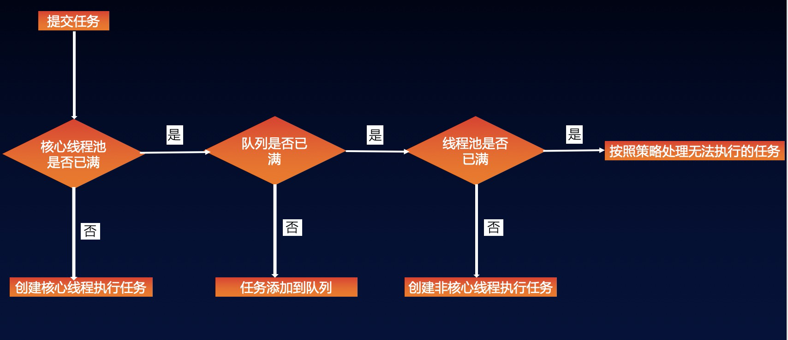

### 线程池的基本原理？

为什么不用Executors创建线程池？
线程池不允许使用Executors去创建，而是通过ThreadPoolExecutor的方式，这样的处理方式让写的同学更加明确线程池的运行规则，规避资源耗尽的风险。 说明：Executors返回的线程池对象的弊端如下：
1. FixedThreadPool和SingleThreadPool:
  允许的请求队列长度为Integer.MAX_VALUE，可能会堆积大量的请求，从而导致OOM。
2. CachedThreadPool:
  允许的创建线程数量为Integer.MAX_VALUE，可能会创建大量的线程，从而导致OOM。

### 原理：



以上线程池的构造函数：

```java
//允许的创建线程数量为Integer.MAX_VALUE，可能会创建大量的线程，从而导致OOM。
public static ExecutorService newCachedThreadPool() {
    return new ThreadPoolExecutor(0, Integer.MAX_VALUE,
                                  60L, TimeUnit.SECONDS,
                                  new SynchronousQueue<Runnable>());
}

//允许的请求队列长度为Integer.MAX_VALUE，可能会堆积大量的请求，从而导致OOM。
public static ExecutorService newSingleThreadExecutor() {
    return new FinalizableDelegatedExecutorService
        (new ThreadPoolExecutor(1, 1,
                                0L, TimeUnit.MILLISECONDS,
                                new LinkedBlockingQueue<Runnable>()));
}

public static ExecutorService newFixedThreadPool(int nThreads) {
    return new ThreadPoolExecutor(nThreads, nThreads,
                                  0L, TimeUnit.MILLISECONDS,
                                  new LinkedBlockingQueue<Runnable>());
}

//队列构造函数
public LinkedBlockingQueue() {
        this(Integer.MAX_VALUE);
}
```


线程池创建的正确打开方式？

```java
//org.apache.commons.lang3.concurrent.BasicThreadFactory
ScheduledExecutorService executorService = new ScheduledThreadPoolExecutor(1,
        new BasicThreadFactory.Builder().namingPattern("example-schedule-pool-%d").daemon(true).build());


//Positive example 2：
ThreadFactory namedThreadFactory = new ThreadFactory() {
    private AtomicInteger count = new AtomicInteger(0);
    @Override
    public Thread newThread(Runnable r) {
        Thread t = new Thread(r);
        String threadName = "Thread"+count.addAndGet(1);
        t.setName(threadName);
        return t;
    }
};

//Common Thread Pool
ExecutorService pool = new ThreadPoolExecutor(5, 200,
        0L, TimeUnit.MILLISECONDS,
        new LinkedBlockingQueue<Runnable>(1024), namedThreadFactory, new ThreadPoolExecutor.AbortPolicy());
```

### 如何限定线程池数量？
CPU密集型 => 线程池的大小推荐为CPU数量 + 1，CPU数量可以根据Runtime.availableProcessors方法获取

O密集型 => CPU数量 * CPU利用率 * (1 + 线程等待时间/线程CPU时间)

混合型 => 将任务分为CPU密集型和IO密集型，然后分别使用不同的线程池去处理，从而使每个线程池可以根据各自的工作负载来调整

阻塞队列 => 推荐使用有界队列，有界队列有助于避免资源耗尽的情况发生

### execute/submit线程池创建的两种方式

execute的实现，解答了线程池线程重复使用的问题，execute/submit本质上查不到，submit是包了FutureTask实现的

### 为什么说core线程不会被回收？core线程的复用机制？
```java
final void runWorker(Worker w) {
        Thread wt = Thread.currentThread();
        Runnable task = w.firstTask;
        w.firstTask = null;
        w.unlock(); // allow interrupts
        boolean completedAbruptly = true;
        try {
            //关键在这个getTask(),进行了线程阻塞循环
            while (task != null || (task = getTask()) != null) {
                w.lock();
                // If pool is stopping, ensure thread is interrupted;
                // if not, ensure thread is not interrupted.  This
                // requires a recheck in second case to deal with
                // shutdownNow race while clearing interrupt
                if ((runStateAtLeast(ctl.get(), STOP) ||
                     (Thread.interrupted() &&
                      runStateAtLeast(ctl.get(), STOP))) &&
                    !wt.isInterrupted())
                    wt.interrupt();
                try {
                    beforeExecute(wt, task);
                    Throwable thrown = null;
                    try {
                        task.run();
                    } catch (RuntimeException x) {
                        thrown = x; throw x;
                    } catch (Error x) {
                        thrown = x; throw x;
                    } catch (Throwable x) {
                        thrown = x; throw new Error(x);
                    } finally {
                        afterExecute(task, thrown);
                    }
                } finally {
                    task = null;
                    w.completedTasks++;
                    w.unlock();
                }
            }
            completedAbruptly = false;
        } finally {
            processWorkerExit(w, completedAbruptly);
        }
}

private Runnable getTask() {
        boolean timedOut = false; // Did the last poll() time out?

        for (;;) {
            int c = ctl.get();
            int rs = runStateOf(c);

            // Check if queue empty only if necessary.
            if (rs >= SHUTDOWN && (rs >= STOP || workQueue.isEmpty())) {
                decrementWorkerCount();
                return null;
            }

            int wc = workerCountOf(c);

            // Are workers subject to culling?
            boolean timed = allowCoreThreadTimeOut || wc > corePoolSize;

            if ((wc > maximumPoolSize || (timed && timedOut))
                && (wc > 1 || workQueue.isEmpty())) {
                if (compareAndDecrementWorkerCount(c))
                    return null;
                continue;
            }

            try {
                //注意这里的take方法
                Runnable r = timed ?
                    workQueue.poll(keepAliveTime, TimeUnit.NANOSECONDS) :
                    workQueue.take();
                if (r != null)
                    return r;
                timedOut = true;
            } catch (InterruptedException retry) {
                timedOut = false;
            }
        }
    }

    /**
     * Retrieves and removes the head of this queue, waiting！！！ if necessary
     * 感兴趣可以看看take的实现，是不断循环阻塞的一个方法
     * until an element becomes available.
     *
     * @return the head of this queue
     * @throws InterruptedException if interrupted while waiting
     */
    E take() throws InterruptedException;
```

### 拒绝机制的手操

拒绝策略 => 默认采用的是AbortPolicy拒绝策略，直接在程序中抛出RejectedExecutionException异常【因为是运行时异常，不强制catch】，这种处理方式不够优雅。处理拒绝策略有以下几种比较推荐：

在程序中捕获RejectedExecutionException异常，在捕获异常中对任务进行处理。针对默认拒绝策略；

使用CallerRunsPolicy拒绝策略，该策略会将任务交给调用execute的线程执行【一般为主线程】，此时主线程将在一段时间内不能提交任何任务，从而使工作线程处理正在执行的任务。此时提交的线程将被保存在TCP队列中，TCP队列满将会影响客户端，这是一种平缓的性能降低；

自定义拒绝策略，只需要实现RejectedExecutionHandler接口即可；

如果任务不是特别重要，使用DiscardPolicy和DiscardOldestPolicy拒绝策略将任务丢弃也是可以的。

当然，如果使用Executors的静态方法创建ThreadPoolExecutor对象，考虑使用Semaphore对任务的执行进行限流也可以避免出现OOM异常


### volatile了解吗？和syncronized的区别？讲一讲AQS？公平锁和非公平锁？
